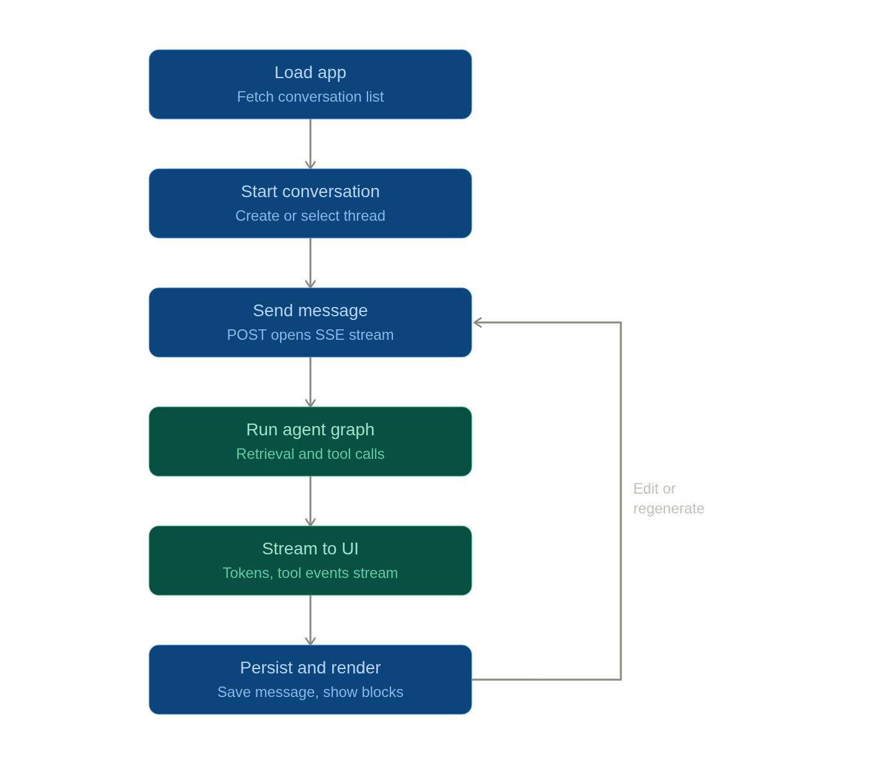

# Architecture overview and plan for the API

That's the loop — now let's walk through what actually happens at each stage, end to end.

## 1. App load

Frontend hits `GET /conversations` on mount, renders the sidebar (title, updated_at, sorted recent-first). No graph invocation yet — this is a pure read from your `conversations` table.

## 2. Start conversation

- **New chat**: `POST /conversations` creates an empty row, returns `id`. Frontend navigates to `/chat/{id}` with no messages rendered yet.
- **Reopen existing**: `GET /conversations/{id}` loads message history from your `messages` table (not from LangGraph's checkpoints — your table is the source of truth for rendering, as we covered earlier).

## 3. Send message

Frontend calls `POST /conversations/{id}/messages` with the text. Backend immediately inserts the user message row, then opens the SSE stream and calls `graph.astream_events(..., config={"thread_id": id})`.

## 4. Run agent graph

LangGraph does its thing — retrieval nodes, tool calls, LLM calls — reading/writing its own checkpoint tables keyed by `thread_id` for state and resumability. This is invisible to the frontend; it only sees the events coming out.

## 5. Stream to UI

Each `on_chat_model_stream`, `on_tool_start`, `on_tool_end` event gets translated into a typed SSE event and pushed to the client as it happens — tokens render live, tool-call chips appear and resolve, citations populate.

## 6. Persist and render

Once the stream completes, the backend assembles the full block list (text + tool_call + tool_result + citation blocks) and writes one assistant message row. The frontend's live-rendered view and the "loaded from history" view use the same block-rendering code, since they're reading the same shape.

## The loop back

Edit or regenerate re-enters at step 3 — same endpoint pattern, just targeting a `parent_id` so it branches rather than appending linearly.

---

A few things this flow deliberately leaves out that you'll want to layer in once the core loop works: auth/session middleware wrapping every route, the `/stop` cancellation path (an `asyncio.Event` checked between chunks), and file upload for RAG documents happening as a separate flow before conversation start. Want me to detail any of those next, or work through the edit/regenerate branching logic specifically since that's usually the trickiest part to get right?
